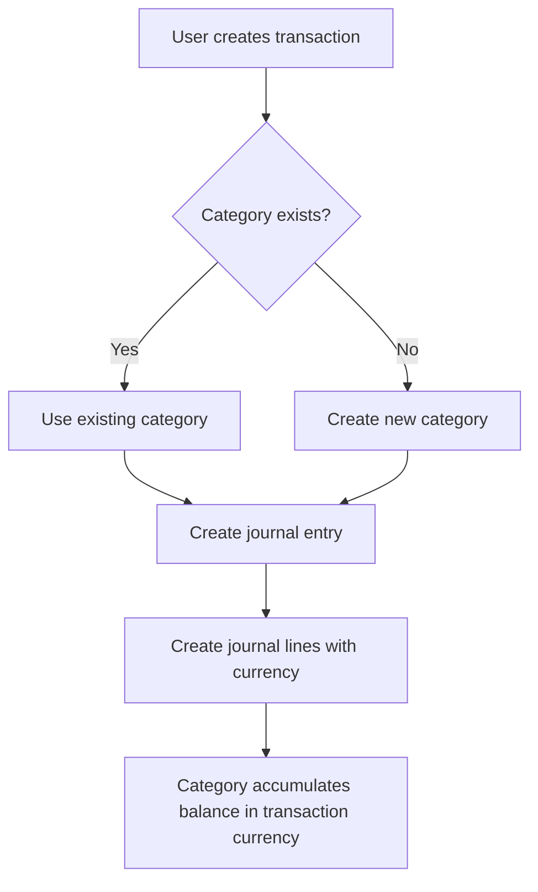

# Design Document: Category Management Improvements

## Overview

This design document outlines the technical approach for implementing currency-agnostic category accounts and improved category management UI. The solution leverages the existing journal line currency field to allow category accounts to accumulate balances in multiple currencies, eliminates the need for currency-specific category accounts, and provides a dedicated UI for managing categories separately from user accounts.

### Key Design Decisions

1. **Currency-agnostic categories**: Category accounts will no longer be restricted by currency. Each journal line already has a currency field, so category accounts can naturally accumulate balances in multiple currencies.

2. **No schema changes required**: The existing database schema already supports this approach - journal lines have currency fields, and accounts have a currency field that can serve as a "default" or "primary" currency for display purposes.

3. **Dedicated Categories page**: A new page will be created specifically for managing category accounts, keeping them separate from user accounts.

4. **Backward compatibility**: Existing category accounts and transactions will continue to work without migration.

## Architecture

### Component Structure

```
src/renderer/
├── pages/
│   ├── Accounts.tsx (modified - filter out category accounts)
│   ├── Categories.tsx (new - dedicated category management)
│   └── AccountTransactionsPage.tsx (no changes needed)
├── components/
│   ├── CategoryModal.tsx (new - create/edit categories)
│   ├── AccountModal.tsx (no changes needed)
│   ├── ManualTransactionModal.tsx (modified - remove currency validation)
│   ├── ImportTransactionsWizard.tsx (modified - handle category creation)
│   ├── Navbar.tsx (modified - add Categories link)
│   └── Sidebar.tsx (modified - add Categories link)
src/services/
└── database.ts (modified - update transaction creation logic)
```

### Data Flow



## Components and Interfaces

### 1. Categories Page (New)

**File**: `src/renderer/pages/Categories.tsx`

**Purpose**: Dedicated page for viewing and managing category accounts

**Key Features**:
- Display all category accounts in a table
- Show balances grouped by currency for each category
- Provide "Add Category" button
- Allow editing and archiving categories
- Separate income categories (asset subtype) from expense categories (liability subtype)

**Interface**:
```typescript
interface CategoryWithBalances {
  id: string;
  name: string;
  type: AccountType.Category;
  subtype: AccountSubtype;
  currency: string; // Default/primary currency
  balances: Record<string, number>; // Currency -> Balance mapping
  isArchived: boolean;
}
```

**UI Layout**:
- Two sections: "Income Categories" and "Expense Categories"
- Table columns: Name, Balances (multi-currency), Actions
- Actions: Edit, Archive/Delete, View Transactions

### 2. CategoryModal Component (New)

**File**: `src/renderer/components/CategoryModal.tsx`

**Purpose**: Modal for creating and editing category accounts

**Props**:
```typescript
interface CategoryModalProps {
  isOpen: boolean;
  onClose: () => void;
  onCategoryCreated: () => void;
  category?: Account; // For editing existing category
}
```

**Form Fields**:
- Category Name (required)
- Type: Income or Expense (required, determines subtype)
- Default Currency (optional, defaults to USD)

### 3. Modified Accounts Page

**File**: `src/renderer/pages/Accounts.tsx`

**Changes**:
- Filter out category accounts from the main accounts list
- Only show user accounts and optionally system accounts
- Remove category-related functionality (moved to Categories page)

### 4. Modified ManualTransactionModal

**File**: `src/renderer/components/ManualTransactionModal.tsx`

**Changes**:
- Remove currency validation that prevents transactions between accounts with different currencies
- Allow category accounts to be selected regardless of currency mismatch
- Display currency information for both accounts in the UI
- Keep existing multi-currency transfer logic for user-to-user transfers

**Key Logic Change**:
```typescript
// OLD: Reject if currencies don't match
if (fromAccount.currency !== toAccount.currency && !isTransfer) {
  return error("Currency mismatch");
}

// NEW: Allow currency mismatch for category transactions
// Only validate currency for user-to-user transfers
if (isTransfer && fromAccount.currency !== toAccount.currency) {
  // Show multi-currency transfer UI
}
```

### 5. Modified ImportTransactionsWizard

**File**: `src/renderer/components/ImportTransactionsWizard.tsx`

**Changes**:
- When a transaction specifies a category name that doesn't exist, auto-create it
- Determine category subtype based on transaction amount (positive = income/asset, negative = expense/liability)
- Set the new category's default currency to match the user account currency
- Display a summary of auto-created categories after import

**Auto-creation Logic**:
```typescript
// During import processing
if (toAccountName && !categoryExists(toAccountName)) {
  const subtype = amount > 0 ? AccountSubtype.Asset : AccountSubtype.Liability;
  await createAccount({
    name: toAccountName,
    type: AccountType.Category,
    subtype: subtype,
    currency: userAccount.currency
  });
  autoCreatedCategories.push(toAccountName);
}
```

### 6. Modified Database Service

**File**: `src/services/database.ts`

**Changes**:
- Remove currency validation in `createJournalEntry` for category transactions
- Update `getAccountsWithBalances` to support multi-currency balance aggregation
- Add helper method to get category balances grouped by currency

**New Method**:
```typescript
public async getCategoryBalancesByCurrency(
  categoryId: string,
  tx?: TransactionClient
): Promise<Record<string, number>> {
  const prisma = tx || this.prisma;
  const lines = await prisma.journalLine.findMany({
    where: { accountId: categoryId },
    select: { amount: true, currency: true }
  });
  
  const balances: Record<string, number> = {};
  for (const line of lines) {
    balances[line.currency] = (balances[line.currency] || 0) + line.amount;
  }
  
  return balances;
}
```

**Modified Method**:
```typescript
// In createJournalEntry, remove this validation for category accounts:
if (fromAccount.currency !== toAccount.currency) {
  // OLD: Always require currency_transfer type
  // NEW: Only require for user-to-user transfers
  if (fromAccount.type === AccountType.User && toAccount.type === AccountType.User) {
    // Multi-currency transfer logic
  } else {
    // Allow different currencies for category transactions
    // Record each line in its respective account's currency
  }
}
```

### 7. Navigation Updates

**Files**: `src/renderer/components/Navbar.tsx`, `src/renderer/components/Sidebar.tsx`

**Changes**:
- Add "Categories" navigation link
- Position it between "Accounts" and "Dashboard" or in a logical location

## Data Models

### Existing Schema (No Changes)

The current Prisma schema already supports multi-currency category accounts:

```prisma
model Account {
  id        String      @id @default(uuid())
  name      String
  type      AccountType
  subtype   AccountSubtype @default(asset)
  currency  String      @default("USD")  // Default/primary currency
  // ... other fields
}

model JournalLine {
  id            String        @id @default(uuid())
  entryId       String
  accountId     String
  amount        Float
  currency      String        // Each line has its own currency
  // ... other fields
}
```

**Key Insight**: The `currency` field on `Account` becomes a "default" or "primary" currency for display purposes, while the actual transaction currency is stored on each `JournalLine`. This allows category accounts to naturally accumulate balances in multiple currencies.

## Error Handling

### Transaction Creation Errors

1. **Missing category during manual transaction**:
   - Error: "Please select a category"
   - Resolution: User must select from existing categories or create a new one

2. **Invalid category name during import**:
   - Error: "Category name cannot be empty"
   - Resolution: Skip transaction or use "Uncategorized Income/Expense"

3. **Duplicate category name**:
   - Warning: "A category with this name already exists"
   - Resolution: Use existing category or prompt user to choose different name

### Balance Calculation Errors

1. **Missing currency in journal line**:
   - Error: "Transaction currency not specified"
   - Resolution: Default to account's primary currency

2. **Invalid currency code**:
   - Warning: "Unknown currency code: XYZ"
   - Resolution: Accept and display as-is (user may have custom currencies)

## Testing Strategy

### Unit Tests

1. **Database Service Tests**:
   - Test `getCategoryBalancesByCurrency` with multiple currencies
   - Test transaction creation with currency mismatch between user and category accounts
   - Test category auto-creation during import

2. **Component Tests**:
   - Test CategoryModal form validation
   - Test Categories page filtering and display
   - Test ManualTransactionModal with multi-currency categories

### Integration Tests

1. **End-to-End Transaction Flow**:
   - Create transaction with USD user account and CAD category account
   - Verify both journal lines have correct currencies
   - Verify category balance shows both USD and CAD amounts

2. **Import Flow**:
   - Import CSV with non-existent category names
   - Verify categories are auto-created with correct subtype
   - Verify transactions are recorded with correct currencies

3. **Multi-Currency Category Balance**:
   - Create multiple transactions in different currencies for same category
   - Verify category balance aggregates correctly by currency
   - Verify dashboard reports show correct multi-currency totals

### Manual Testing Scenarios

1. **Create category and use across currencies**:
   - Create "Groceries" category with USD default
   - Create transaction from CAD bank account to Groceries
   - Verify Groceries shows both USD and CAD balances

2. **Import with auto-category creation**:
   - Import CSV with category names in "toAccountId" column
   - Verify new categories are created
   - Verify import summary shows auto-created categories

3. **Navigate between Accounts and Categories pages**:
   - Verify Accounts page shows only user accounts
   - Verify Categories page shows only category accounts
   - Verify navigation links work correctly

## Migration and Backward Compatibility

### No Database Migration Required

The existing schema already supports this feature. All existing data will work without changes:

- Existing category accounts keep their currency field (becomes "default" currency)
- Existing journal lines already have currency fields
- Existing transactions continue to work as before

### Behavioral Changes

1. **Transaction Creation**: Users can now create transactions between accounts with different currencies without the system rejecting them (for category transactions)

2. **Category Display**: Category balances will now show multiple currencies if the category has been used with different currencies

3. **Import Behavior**: Categories will be auto-created during import if they don't exist, rather than failing or using "Uncategorized"

### Rollback Plan

If issues arise, the changes can be rolled back by:
1. Reverting the UI changes (Categories page, navigation)
2. Restoring currency validation in transaction creation
3. Existing data remains intact and functional
