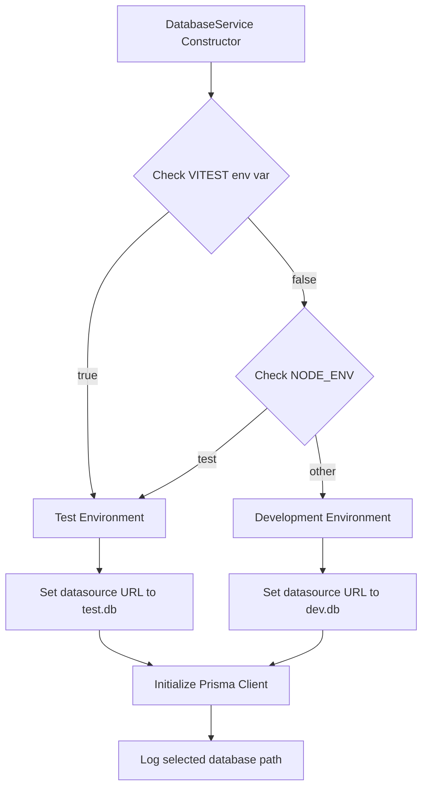

# Design Document: Test Database Separation

## Overview

This design establishes a clear separation between test and development databases for the Bucky bookkeeping application. The solution uses environment detection to automatically route database connections to the appropriate SQLite file based on the execution context (test vs development). This ensures test isolation, prevents data corruption, and maintains reliable test execution while keeping the same schema and business logic across both environments.

The design leverages Prisma's datasource URL configuration and Node.js environment variables to achieve separation without requiring code duplication or manual configuration by developers.

## Architecture

### High-Level Architecture

```
┌─────────────────────────────────────────────────────────────┐
│                     Application Layer                        │
│  (DatabaseService, IPC Handlers, UI Components)             │
└────────────────────┬────────────────────────────────────────┘
                     │
                     ▼
┌─────────────────────────────────────────────────────────────┐
│              Environment Detection Layer                     │
│  - Detects NODE_ENV and VITEST environment variables        │
│  - Determines appropriate database path                      │
│  - Configures Prisma Client datasource URL                  │
└────────────────────┬────────────────────────────────────────┘
                     │
          ┌──────────┴──────────┐
          ▼                     ▼
┌──────────────────┐  ┌──────────────────┐
│  Test Database   │  │  Dev Database    │
│  (test.db)       │  │  (dev.db)        │
│  - Isolated      │  │  - Persistent    │
│  - Ephemeral     │  │  - User data     │
└──────────────────┘  └──────────────────┘
```

### Database File Structure

```
prisma/
├── schema.prisma          # Single source of truth for schema
├── dev.db                 # Development database (existing)
├── dev.db-journal         # SQLite journal file (dev)
├── test.db                # Test database (new)
├── test.db-journal        # SQLite journal file (test)
└── migrations/            # Shared migrations for both databases
    └── ...
```

### Environment Detection Flow



## Components and Interfaces

### 1. DatabaseService Modifications

**Location:** `src/services/database.ts`

**Changes:**
- Modify constructor to detect environment and set appropriate database URL
- Add database path logging for debugging
- Maintain singleton pattern with environment-aware initialization

**Interface:**
```typescript
class DatabaseService {
  private static instance: DatabaseService;
  private prisma: PrismaClient;
  private databasePath: string; // New: track which DB is being used

  private constructor() {
    // Environment detection logic
    const isTest = process.env.VITEST === 'true' || process.env.NODE_ENV === 'test';
    
    // Determine database file path
    this.databasePath = isTest ? 'file:./test.db' : 'file:./dev.db';
    
    // Configure Prisma Client with environment-specific datasource
    this.prisma = new PrismaClient({
      datasources: {
        db: {
          url: this.databasePath,
        },
      },
      log: isTest ? ['error'] : ['query', 'info', 'warn', 'error'],
    });
    
    console.log(`[DatabaseService] Using database: ${this.databasePath}`);
  }

  // Existing methods remain unchanged
  public static getInstance(): DatabaseService { ... }
  public async initialize() { ... }
  // ... all other methods
}
```

### 2. Test Setup Utilities

**Location:** `src/services/database.test.utils.ts` (new file)

**Purpose:** Provide utilities for test database management

**Interface:**
```typescript
/**
 * Reset the test database to a clean state.
 * Deletes all data and recreates default accounts.
 * Should be called in beforeEach hooks for tests that need isolation.
 */
export async function resetTestDatabase(): Promise<void>;

/**
 * Initialize the test database with schema.
 * Creates the database file if it doesn't exist and applies migrations.
 * Should be called once before running the test suite.
 */
export async function initializeTestDatabase(): Promise<void>;

/**
 * Seed the test database with common test data.
 * Useful for integration tests that need a consistent starting state.
 */
export async function seedTestDatabase(data?: TestSeedData): Promise<void>;

/**
 * Get the current test database path.
 * Useful for debugging and verification.
 */
export function getTestDatabasePath(): string;
```

### 3. Vitest Configuration Updates

**Location:** `vitest.config.ts`

**Changes:**
- Add setup file to initialize test database before tests run
- Configure environment variables for test context
- Add global test hooks for database cleanup

**Configuration:**
```typescript
import { defineConfig } from 'vitest/config';
import path from 'path';

export default defineConfig({
  test: {
    globals: true,
    environment: 'node',
    setupFiles: ['./src/services/database.test.setup.ts'], // New setup file
    env: {
      NODE_ENV: 'test',
      VITEST: 'true',
    },
  },
  resolve: {
    alias: {
      '@': path.resolve(__dirname, './src'),
    },
  },
});
```

### 4. Test Setup File

**Location:** `src/services/database.test.setup.ts` (new file)

**Purpose:** Global test setup that runs before all tests

**Implementation:**
```typescript
import { beforeAll, afterAll } from 'vitest';
import { initializeTestDatabase } from './database.test.utils';
import { databaseService } from './database';

// Initialize test database before all tests
beforeAll(async () => {
  await initializeTestDatabase();
  await databaseService.initialize();
});

// Disconnect after all tests
afterAll(async () => {
  await databaseService.disconnect();
});
```

### 5. Package.json Script Updates

**Location:** `package.json`

**New Scripts:**
```json
{
  "scripts": {
    "test": "vitest --run",
    "test:watch": "vitest",
    "test:ui": "vitest --ui",
    "test:db:reset": "rm -f prisma/test.db && npm run test:db:migrate",
    "test:db:migrate": "DATABASE_URL=\"file:./test.db\" prisma migrate deploy",
    "test:db:push": "DATABASE_URL=\"file:./test.db\" prisma db push",
    "dev:db:reset": "rm -f prisma/dev.db && npm run prisma:migrate"
  }
}
```

### 6. .gitignore Updates

**Location:** `.gitignore`

**Additions:**
```
# Test database files
prisma/test.db
prisma/test.db-journal
```

## Data Models

No changes to existing Prisma schema are required. Both test and development databases will use the same schema defined in `prisma/schema.prisma`. The only difference is the datasource URL, which is configured at runtime.

### Schema Consistency

The same Prisma schema applies to both databases:
- All models (Account, JournalEntry, JournalLine, Checkpoint, etc.) remain identical
- All relationships and constraints are preserved
- Migrations are shared between both databases

## Correctness Properties

*A property is a characteristic or behavior that should hold true across all valid executions of a system-essentially, a formal statement about what the system should do. Properties serve as the bridge between human-readable specifications and machine-verifiable correctness guarantees.*

### Property 1: Environment-based database isolation

*For any* test execution, the database operations should only affect the test database file and never modify the development database file.

**Validates: Requirements 1.1, 1.3**

### Property 2: Schema consistency across environments

*For any* database operation, the schema constraints and business logic should behave identically in test and development environments.

**Validates: Requirements 2.1, 2.3**

### Property 3: Test database reset idempotence

*For any* test database state, calling the reset function should always result in the same clean initial state with default accounts.

**Validates: Requirements 3.1, 3.4**

### Property 4: Environment detection correctness

*For any* execution context, the environment detection logic should correctly identify test vs development environment based on environment variables.

**Validates: Requirements 4.1, 4.2, 4.3**

### Property 5: Test data non-persistence

*For any* test that creates database records, those records should not exist in the test database after a reset operation.

**Validates: Requirements 3.2**

### Property 6: Development database preservation

*For any* test suite execution, the development database file should remain unchanged (same file size, modification time, and content) before and after tests run.

**Validates: Requirements 1.5**

### Property 7: Migration application consistency

*For any* migration applied to the development database, applying the same migration to the test database should result in identical schema structures.

**Validates: Requirements 2.2, 2.4**

## Error Handling

### Environment Detection Failures

**Scenario:** Environment variables are not set or are ambiguous

**Handling:**
- Default to development database with a warning log
- Never default to test database to prevent accidental data loss
- Log the detected environment and selected database path

**Example:**
```typescript
if (!isTest && !isDev) {
  console.warn('[DatabaseService] Unable to detect environment, defaulting to development database');
  this.databasePath = 'file:./dev.db';
}
```

### Database File Access Errors

**Scenario:** Database file cannot be created or accessed

**Handling:**
- Throw descriptive error with file path and permissions information
- Suggest checking file system permissions
- For test database, suggest running `npm run test:db:reset`

**Example:**
```typescript
try {
  await this.prisma.$connect();
} catch (error) {
  throw new Error(
    `Failed to connect to database at ${this.databasePath}. ` +
    `Check file permissions and ensure the directory exists. ` +
    `For test database issues, try: npm run test:db:reset`
  );
}
```

### Migration State Mismatch

**Scenario:** Test database schema is out of sync with migrations

**Handling:**
- Detect migration state mismatch during initialization
- Provide clear error message with resolution steps
- Suggest running `npm run test:db:migrate` to apply pending migrations

**Example:**
```typescript
if (isTest) {
  const pendingMigrations = await checkPendingMigrations();
  if (pendingMigrations.length > 0) {
    throw new Error(
      `Test database has ${pendingMigrations.length} pending migrations. ` +
      `Run: npm run test:db:migrate`
    );
  }
}
```

### Test Database Reset Failures

**Scenario:** Reset operation fails due to locked database or foreign key constraints

**Handling:**
- Disconnect all connections before reset
- Use transaction to ensure atomic reset
- If reset fails, delete and recreate the database file

**Example:**
```typescript
export async function resetTestDatabase(): Promise<void> {
  try {
    await databaseService.resetAllData();
  } catch (error) {
    console.warn('[Test Utils] Reset failed, recreating database file');
    await databaseService.disconnect();
    await fs.unlink('prisma/test.db');
    await initializeTestDatabase();
  }
}
```

## Testing Strategy

### Unit Testing Approach

Unit tests will verify individual components of the database separation mechanism:

1. **Environment Detection Tests**
   - Test that `VITEST=true` results in test database selection
   - Test that `NODE_ENV=test` results in test database selection
   - Test that absence of test indicators results in dev database selection
   - Test that database path is correctly logged

2. **Database Path Configuration Tests**
   - Test that Prisma Client receives correct datasource URL
   - Test that database file path is accessible
   - Test that multiple DatabaseService instances use the same database

3. **Test Utility Function Tests**
   - Test that `resetTestDatabase()` clears all data
   - Test that `initializeTestDatabase()` creates database file
   - Test that `seedTestDatabase()` creates expected records

### Property-Based Testing Approach

Property-based tests will verify universal properties across all database operations:

**Testing Library:** fast-check (already in use)

**Configuration:** Each property test will run a minimum of 100 iterations

**Property Test Tagging:** Each test will include a comment with the format:
```typescript
/**
 * Feature: test-database-separation, Property 1: Environment-based database isolation
 * 
 * For any test execution, the database operations should only affect the test database
 * file and never modify the development database file.
 * 
 * Validates: Requirements 1.1, 1.3
 */
```

**Property Tests to Implement:**

1. **Property 1: Environment-based database isolation**
   - Generate random database operations (create, read, update, delete)
   - Execute operations in test environment
   - Verify development database file is unchanged
   - Verify test database file contains the changes

2. **Property 2: Schema consistency across environments**
   - Generate random valid data for each model
   - Create records in both test and development databases
   - Verify same constraints apply (unique, foreign key, etc.)
   - Verify same validation rules apply

3. **Property 3: Test database reset idempotence**
   - Generate random database state (accounts, transactions, etc.)
   - Call reset function
   - Verify resulting state matches expected clean state
   - Call reset again and verify state is still the same

4. **Property 4: Environment detection correctness**
   - Generate random combinations of environment variables
   - Initialize DatabaseService with each combination
   - Verify correct database path is selected
   - Verify correct logging occurs

5. **Property 5: Test data non-persistence**
   - Generate random test data
   - Create records in test database
   - Call reset function
   - Verify records no longer exist

6. **Property 6: Development database preservation**
   - Capture development database state (checksum, size, modification time)
   - Run full test suite
   - Verify development database state is unchanged

7. **Property 7: Migration application consistency**
   - Apply migrations to both databases
   - Query schema information from both databases
   - Verify table structures, indexes, and constraints match

### Integration Testing

Integration tests will verify the complete flow of database operations in both environments:

1. **Test Environment Integration**
   - Run existing test suite and verify all tests pass
   - Verify test database is used (check logs)
   - Verify development database is not modified

2. **Development Environment Integration**
   - Start development application
   - Perform database operations through UI
   - Verify operations persist to development database
   - Verify test database is not affected

3. **Migration Integration**
   - Create a new migration
   - Apply to development database
   - Apply to test database
   - Verify both databases have identical schema

### Test Isolation Strategy

Each test file should follow this pattern:

```typescript
import { describe, it, expect, beforeEach, afterEach } from 'vitest';
import { databaseService } from './database';
import { resetTestDatabase } from './database.test.utils';

describe('Feature Tests', () => {
  beforeEach(async () => {
    // Reset database to clean state before each test
    await resetTestDatabase();
  });

  afterEach(async () => {
    // Optional: cleanup specific test data
    // Most cleanup handled by beforeEach reset
  });

  it('should perform operation', async () => {
    // Test implementation
  });
});
```

### Existing Test Migration

Existing tests need minimal changes:

1. **Remove `.skip` from property-based tests**
   - Tests currently skip because they touch the real database
   - With test database separation, they can run safely

2. **Add reset calls to test setup**
   - Add `beforeEach` hooks with `resetTestDatabase()`
   - Ensures each test starts with clean state

3. **Update cleanup logic**
   - Remove manual cleanup code where possible
   - Rely on database reset for cleanup

**Example Migration:**

Before:
```typescript
describe.skip('Account Group Tests', () => {
  // Tests skipped to avoid touching dev database
});
```

After:
```typescript
describe('Account Group Tests', () => {
  beforeEach(async () => {
    await resetTestDatabase();
  });
  
  // Tests now run safely against test database
});
```

## Implementation Notes

### Prisma Client Instantiation

The Prisma Client must be instantiated with the datasource URL override in the constructor. This cannot be changed after instantiation, which is why environment detection must happen in the DatabaseService constructor.

### SQLite File Locking

SQLite uses file-level locking. If tests run in parallel and share the same database file, they may encounter locking issues. The current test configuration runs tests serially by default, which avoids this issue. If parallel test execution is needed in the future, consider:
- Using in-memory SQLite databases (`:memory:`)
- Creating separate database files per test worker
- Using a different database engine for tests (e.g., PostgreSQL with test containers)

### Migration Management

Migrations should be developed and tested against the development database first, then applied to the test database. The workflow is:

1. Develop feature and create migration: `npm run prisma:migrate`
2. Test migration on development database
3. Apply migration to test database: `npm run test:db:migrate`
4. Run tests to verify migration works correctly

### Performance Considerations

- Test database resets should be fast (< 100ms) since they run before each test
- Use `DELETE` statements instead of `DROP/CREATE` for faster resets
- Consider keeping test database in memory for faster I/O (future optimization)

### Debugging Support

Add environment variable to control database logging:

```typescript
const isTest = process.env.VITEST === 'true' || process.env.NODE_ENV === 'test';
const verboseLogging = process.env.DB_VERBOSE === 'true';

this.prisma = new PrismaClient({
  datasources: { db: { url: this.databasePath } },
  log: (isTest && !verboseLogging) ? ['error'] : ['query', 'info', 'warn', 'error'],
});
```

This allows developers to enable verbose logging in tests when debugging:
```bash
DB_VERBOSE=true npm test
```
